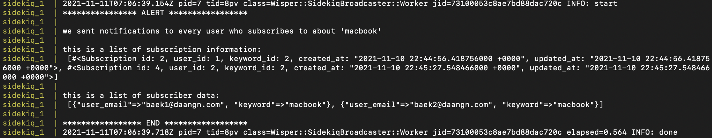
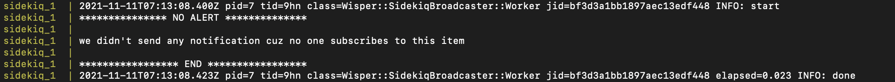

<h1 align="center">Ruby on Rails Project 🍉</h1>

## ✨ Demo

<p align="center">
  
</p>

## 🚀 Built with

- Ruby 3.0.2 
- Rails 6.1.4
- Redis
- Wisper
- Sidekiq

## 💻 Getting Started


### Installation

1. Clone the repository
   ```sh
   git clone https://github.com/doyunbk/ruby-pub-sub.git
   ```
2. Navigate the project folder
   ```sh
   cd project
   ```


### Usage

#### Run in Docker 🐳

_Build and run application in `Docker`_

```sh
docker-compose up --build

OR

docker-compose up
```

#### Run in Local 🏠
_Run application in `Rails`_

```sh
rails s
```

## 📦 Structure

#### Models

- `User`
```
fields : email, password
```

- `Item`
```
fields : title, price, description, user_id
```

- `Keyword`
```
fields : name
```

- `Subscription`
```
fields : user_id, keyword_id
```


#### CRUD API Operations

##### 1. `User`

- Create : Create an `User` 
- Get : Fetch `User` details
- Update : Edit `User` details
- Delete : Delete an `User` 🚨 `Item` and `Subscription` records will be deleted accordingly

##### 2. `Item`
- Create : Create an `Item` 👂🏻 Subscribing events in `ItemListner`
- Get : Fetch `Item` details
- Update : Edit `Item` details
- Delete : Delete an `Item`

##### 3. `Keyword`
- Create : Create a `Keyword` 
- Get : Fetch `Keyword` details
- Update : Edit `Keyword` details
- Delete : Delete a `Keyword` 🚨 `Subscription` records will be deleted accordingly

##### 4. `Subscription`
- Create : Create a `Subscription`
- Get : Fetch `Subscription` details
- Update : Edit `Subscription` details
- Delete : Delete a `Subscription`

##### 🤔 _`ItemListner` have two event subscriptions_
1. When an `Item` is created, send the keyword alerts to the users 
2. If `Item` is not created successfully, send the notification to an user

### 👨🏻‍💻👩🏻‍💻 Example of Usage

The sample data set is in this project

`User`
```
id: 1, email : baek1@gmail.com
id: 2, email : baek2@gmail.com
id: 3, email : baek3@gmail.com 
```

`Keyword`
```
id: 1, name: iphone
id: 2, name: macbook
id: 3, name: imac
id: 4, name: vans
```

`Subscription`
```
id: 1, user_id: 1, keyword_id: 1
id: 2, user_id: 1, keyword_id: 2
id: 3, user_id: 1, keyword_id: 3
id: 4, user_id: 2, keyword_id: 2
id: 5, user_id: 2, keyword_id: 3
id: 6, user_id: 3, keyword_id: 3
```

When `user_id: 3` creates the item of `macbook`,
the keywords alerts will be sent to the users who subscribe for `macbook`
In this sample set, `user_id: 1` & `user_id: 2` will receive the notifications

```sh
curl --location --request POST 'http://0.0.0.0:3000/api/v1/items/' \
--header 'Content-Type: application/json' \
--data-raw '{
    "user_id": "3",
    "title": "2021 M1 brand new macbook",
    "price": 1800,
    "description": "this is 2021 M1 brand new macbook"
}'
```

<p align="center">
  
</p>

When `user_id: 1` creates the item of `vans`,
the keyword alerts will not be sent to anyone because no one subscribes for `vans`

```sh
curl --location --request POST 'http://0.0.0.0:3000/api/v1/items/' \
--header 'Content-Type: application/json' \
--data-raw '{
    "user_id": "1",
    "title": "vans old skool shoes",
    "price": 1800,
    "description": "this is black vans old skool shoes in mint condition"
}'
```
<p align="center">
  
</p>


## 🎁 Notification

### Pub/Sub Pattern

In this project, `Pub/Sub` design pattern is implemented for the notification feature.
`Pub/Sub` is an architecture design pattern that provides a framwork for exchanging messages between publishers and subscribers asynchronosly.
The publisher publishes messages on a topic, and the subscriber subscribes to the topic to recieve messages.


## 🛠 Comparison between naive and string-searching approaches

### Synchronous notification
```
# of Users: 10000
# of Keywords: 10000
# of Subscriptions: 1
```
##### 10 trials of a naive approach
###### Response time(ms)

- 186
- 144
- 205
- 165
- 161
- 131
- 140
- 143
- 206
- 149

###### Data Access time(ms)

- 29.2
- 23.8
- 28.0
- 49.9
- 38.3
- 24.3
- 25.5
- 28.2
- 31.5
- 34.4

1. Average Response time: 163ms
2. Average Data Access time: 31.3ms


##### 10 trials of a string-searching approach
###### Response time(ms)

- 107
- 117
- 110
- 113
- 116
- 115
- 112
- 116
- 115
- 117

###### Data Access time(ms)
- 4.3
- 4.6
- 4.4
- 5.1
- 4.9
- 5.6
- 3.7
- 6.4
- 3.9 
- 3.5

1. Average Response time: 113.8ms
2. Average Data Access time: 4.6ms


```
# of Users: 10000
# of Keywords: 10000
# of Subscriptions: 10000
```

##### 10 trials of a naive approach
###### Response time(ms)
- 1117
- 1168
- 1145
- 1102
- 1035
- 1074
- 1066
- 1300
- 1033
- 1417

###### Data Access time(ms)
- 134.2
- 129.9
- 136.5
- 129.4
- 114.2
- 120.7
- 116.9
- 139.4
- 120.3
- 169.2

1. Average Response time: 1145.7ms
2. Average Data Access time: 131.1ms

##### 10 trials of a string-searching approach
###### Response time(ms)
- 1118
- 1111
- 1056
- 1032
- 1156
- 1092
- 1134
- 1023
- 1059
- 1122

###### Data Access time(ms)
- 96.9
- 107.1
- 93.9
- 98.6
- 116.2
- 99.4
- 101.3
- 95.3
- 93.2
- 99.7

1. Average Response time: 1090.3ms
2. Average Data Access time: 100.2ms

### Asynchronous notification

```
# of Users: 10000
# of Keywords: 10000
# of Subscriptions: 1
```

##### 10 trials of a naive approach
###### Eclapsed time(ms)

- 0.14
- 0.134
- 0.133
- 0.135
- 0.169
- 0.153
- 0.147
- 0.145
- 0.172
- 0.163

Average Elapsed time: 0.1491ms

##### 10 trials of a string-searching approach
###### Eclapsed time(ms)

- 0.128
- 0.137
- 0.129
- 0.130
- 0.147
- 0.118
- 0.159
- 0.144
- 0.165
- 0.149

Average Elapsed time: 0.1406ms


```
# of Users: 10000
# of Keywords: 10000
# of Subscriptions: 1000
```

##### 10 trials of a naive approach
###### Eclapsed time(ms)

- 1.252
- 0.987
- 0.913
- 0.834
- 0.989
- 0.933
- 0.912
- 1.142
- 0.922
- 1.035

Average Elapsed time: 0.9919ms

##### 10 trials of a string-searching approach
###### Eclapsed time(ms)

- 0.789
- 0.933
- 0.846
- 0.9
- 0.921
- 0.888
- 0.875
- 0.877
- 0.822
- 0.859

Average Elapsed time: 0.871ms